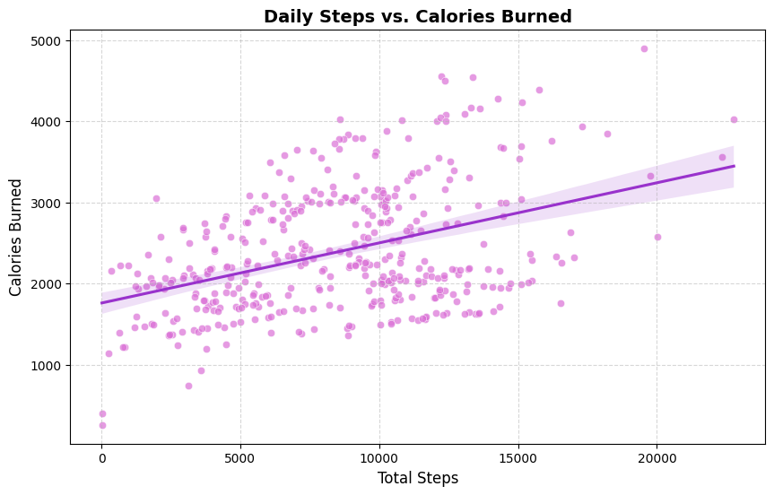
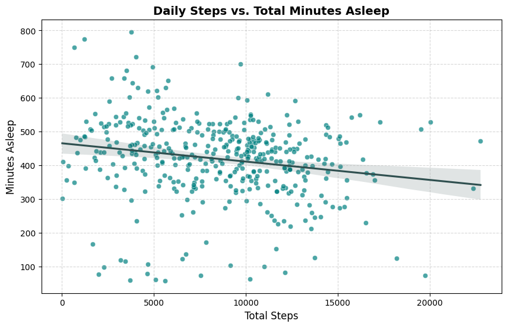
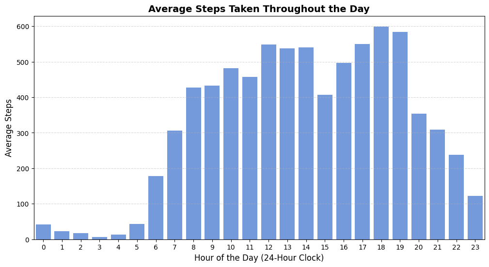
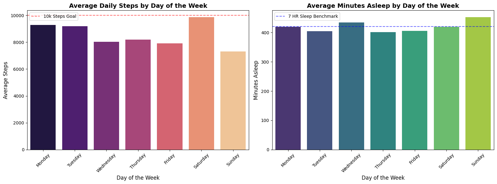
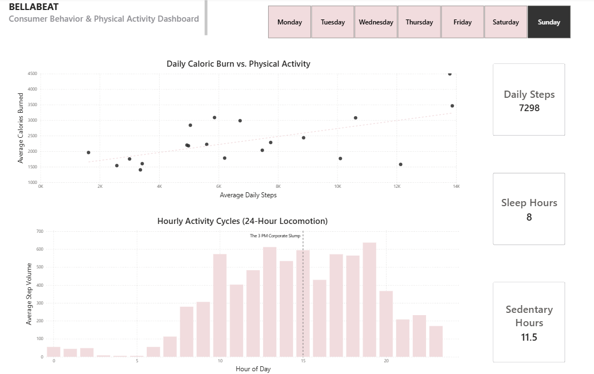

# Bellabeat Consumer Behavior Case Study
**An End-to-End Data Analytics Portfolio Project**

## Executive Summary
This case study analyzes public smart-tracker data to uncover distinct consumer physical activity, sedentary, and sleep habits. Utilizing **Python (Pandas, NumPy, Matplotlib, Seaborn)** for algorithmic data cleaning and exploratory data analysis, and **Power BI Desktop** for semantic modeling and interactive visualization, the project maps a detailed 7-day lifestyle cycle. The ultimate insights are translated into tactical, high-yield product and digital marketing recommendations to drive Bellabeat's subscription ecosystem and global brand equity.

---

## Phase 1: Ask (Defining the Business Task)

### 1. The Core Business Objective
The objective is to analyze non-Bellabeat smart device data (Fitbit) to uncover distinct consumer behavioral trends across activity, sedentary behavior, and sleep patterns. These insights are strategically applied to Bellabeat's dual-tier business model:
**Hardware Layer:** Positioning the screenless, fashion-forward Bellabeat Leaf as the primary physical data-collection gateway.
**Software Layer:** Positioning the subscription-based Bellabeat Membership as the essential digital ecosystem for personalized health and wellness guidance.

### 2. Stakeholder Requirements
**Urška Sršen (Co-founder & Chief Creative Officer):** Requires high-level consumer behavior trends and data-driven marketing narratives on when and how to target digital ads.
**Sando Mur (Co-founder & Mathematician):** Demands structurally sound, mathematically backed analytical evidence that explicitly accounts for data limitations and integrity audits.
**Bellabeat Analytics Team:** Requires clean, well-documented, and reproducible code structures.

---

## Phase 2: Prepare (Data Sourcing & Quality Audit)

### 1. Data Metadata & Architecture
**Source:** Public domain dataset via Möbius on Kaggle (FitBit Fitness Tracker Data).
**Origin:** Distributed user tracking survey hosted via Amazon Mechanical Turk.
**Temporal Scope:** April 12, 2016 – May 12, 2016 (31-day tracking window).
**Monitored Tables:** Relational tables loaded include `dailyActivity_merged.csv`, `sleepDay_merged.csv`, and `hourlySteps_merged.csv`.
**Key Mapping:** `Id` acts as the Primary Key across all tables, while `ActivityDate` / `Date` serves as the Composite Key to link daily movement intensity directly to corresponding sleep windows.

### 2. The ROCCC Data Audit
**Reliable (POOR):** Contains data for only 33 unique users for activity, dropping to 24 for sleep, introducing potential selection bias.
**Original (LOW):** Third-party crowdsourced data rather than direct primary telemetry.
**Comprehensive (MEDIUM):** Features rich intraday and hourly distributions, but completely lacks demographic parameters (age, gender, location).
**Current (POOR):** Collected in 2016; functions as a proxy baseline rather than a reflection of modern wearable engagement.
**Cited (GOOD):** Clearly documented, publicly dedicated domain data (CC0).

### 3. Portfolio Strategic Pivots
**The Gender Blindness Pivot:** Because data is gender-anonymous, we treat it as a general proxy for adult movement but filter creative solutions through a female-first lifestyle lens.
**The Drop-off Friction Pivot:** 9 out of 33 users failed to track sleep data. This tracking drop-off is isolated as a key behavioral metric to market the Bellabeat Leaf's extended 6-month battery life and zero-friction jewelry design.

---

## Phase 3: Process (Data Cleansing Pipeline in Python)

Python 3 within a Google Colab environment was leveraged to ensure reproducible cleaning, prevent spreadsheet manual errors, and handle long intraday tracking arrays smoothly.

### Code Execution Ledger:

#### Cell 1: Import Libraries & Load Raw Datasets
```python
import pandas as pd
import numpy as np

# Load all three raw datasets
activity_df = pd.read_csv('dailyActivity_merged.csv')
sleep_df = pd.read_csv('sleepDay_merged.csv')
hourly_steps = pd.read_csv('hourlySteps_merged.csv')

print("All 3 datasets successfully loaded into the workspace!")
```

* **Log Output Summary:** `All 3 datasets successfully loaded into the workspace!`

#### Cell 2: Initial Inspection (Daily Activity Data)
```python
print("--- Daily Activity Dataset Info ---")
activity_df.info()

print("\n--- First 5 Rows Preview ---")
activity_df.head()
```
* **Log Output Summary:** 940 entries, 15 columns. 0 missing values. `ActivityDate` detected as a text string (`object`) blocking time-series slicing.

#### Cell 3: Clean Daily Activity Data
```python
# Convert ActivityDate from 'object' to 'datetime'
activity_df['ActivityDate'] = pd.to_datetime(activity_df['ActivityDate'], format='%m/%d/%Y')

# Count unique users and duplicates
unique_activity_users = activity_df['Id'].nunique()
activity_duplicates = activity_df.duplicated().sum()

# Drop duplicates
activity_df = activity_df.drop_duplicates()

print(f"Format Fix: 'ActivityDate' type is now {activity_df['ActivityDate'].dtype}")
print(f"Sample Size: There are {unique_activity_users} unique users in this dataset.")
print(f"Duplicates found and removed: {activity_duplicates}")
```

* **Log Output Summary:** Converted to `datetime64[ns]`. 33 unique users confirmed (n > 30). 0 duplicates removed.

#### Cell 4: Initial Inspection & Clean Sleep Data
```python
print("--- Sleep Dataset Info ---")
sleep_df.info()
print(f"\nInitial Sleep Duplicates: {sleep_df.duplicated().sum()}")

# Remove duplicates and fix the date format
sleep_df = sleep_df.drop_duplicates()
sleep_df['SleepDay'] = pd.to_datetime(sleep_df['SleepDay'], errors='coerce')

# Verify results
print(f"\nCleaned Sleep Duplicates: {sleep_df.duplicated().sum()}")
print(f"Unique users in Sleep dataset: {sleep_df['Id'].nunique()}")
```

* **Log Output Summary:** 3 hidden duplicate records successfully purged. Unique user count dropped to 24, confirming that 9 users omitted sleep tracking.

#### Cell 5: Initial Inspection (Hourly Steps Data)
```python
print("--- Hourly Steps Info ---")
hourly_steps.info()

print("\n--- Hourly Steps Preview ---")
display(hourly_steps.head())
```

* **Log Output Summary:** 22,099 rows structured. `ActivityHour` detected as string/object. 33 unique users mapped.

#### Cell 6: Clean and Feature Engineer Hourly Steps Data
```python
# Convert ActivityHour to datetime
hourly_steps['ActivityHour'] = pd.to_datetime(hourly_steps['ActivityHour'], errors='coerce')

# Extract Hour (0-23) and pure calendar Date
hourly_steps['Hour'] = hourly_steps['ActivityHour'].dt.hour
hourly_steps['Date'] = hourly_steps['ActivityHour'].dt.date

# Perform duplicate sanity check & clean
hourly_duplicates = hourly_steps.duplicated().sum()
hourly_steps = hourly_steps.drop_duplicates()
unique_hourly_users = hourly_steps['Id'].nunique()

print(f"Format Fix: 'ActivityHour' type is now {hourly_steps['ActivityHour'].dtype}")
print(f"Feature Engineering: Extracted hours ({hourly_steps['Hour'].min()}-{hourly_steps['Hour'].max()}) and isolated pure Dates.")
print(f"Hourly Duplicates found and removed: {hourly_duplicates}")
print(f"Unique users verified in hourly records: {unique_hourly_users}")
```

* **Log Output Summary:** Timestamps parsed into uniform datetime format. Hourly attributes (0-23) and calendar Dates engineered. 0 duplicates removed.

#### Cell 7: Structural Column Renaming and Master Composite Merge
```python
# Standardize joining keys across dataframes
activity_df = activity_df.rename(columns={'ActivityDate': 'Date'})
sleep_df = sleep_df.rename(columns={'SleepDay': 'Date'})

# Execute an Inner Join on both the Primary Key (Id) and Composite Key (Date)
combined_df = pd.merge(activity_df, sleep_df, on=['Id', 'Date'], how='inner')

print("--- Combined Master Dataset Info ---")
combined_df.info()
print(f"\nUnique users in combined data: {combined_df['Id'].nunique()}")
```

* **Log Output Summary:** Compiled master data with 410 completely integrated rows across the 24 active sleep-tracking users.

#### Cell 8: Mount Google Drive and Secure Clean Data Export
```python
import os
from google.colab import drive

# Open the secure gateway to Google Drive
# drive.mount('/content/drive')

# Define absolute corporate file path on Drive
# (Feel free to change 'Bellabeat_Case_Study' to match your actual root folder name)
target_directory = '/content/drive/MyDrive/Bellabeat_Case_Study/02_Clean_Data'

# Create the '02_Clean_Data' directory if it doesn't exist yet
os.makedirs(target_directory, exist_ok=True)

# Stream clean DataFrames directly into permanent cloud repository
combined_df.to_csv(f'{target_directory}/daily_activity_sleep_clean.csv', index=False)
hourly_steps.to_csv(f'{target_directory}/hourly_steps_clean.csv', index=False)

print("\n" + "="*60)
print(f"PIPELINE SECURED: Clean data permanently synced to:\n{target_directory}")
print("="*60)
```

* **Log Output Summary:** `PIPELINE SECURED: Clean data permanently synced to: /content/drive/MyDrive/Bellabeat_Case_Study/02_Clean_Data`. Assets successfully locked to permanent cloud storage, closing out the Processing pipeline.

---

## Phase 4: Analyze (Exploratory Data Analysis in Python)
Before introducing the clean assets into business intelligence systems, programmatic Exploratory Data Analysis (EDA) was executed inside Google Colab to pull baseline trend summaries and pinpoint user habits.

## **1. 1. Central Tendency Benchmarks**
####  Cell 8: Summary Statistics (Transition to Analyze Phase)
Summary statistics were extracted on the merged tables to review user compliance against global CDC health metrics:
```python
# Generate summary statistics for key daily metrics
analysis_summary = combined_df[['TotalSteps', 'VeryActiveMinutes', 'SedentaryMinutes', 'Calories', 'TotalMinutesAsleep', 'TotalTimeInBed']].describe()

print("--- Key Daily Metrics Summary Statistics ---")
display(analysis_summary.round(2))
```

*  **The Daily Steps Gap**: Users averaged **8,514.91 steps per day**, outlining a ~1,485-step deficit against the universal target of 10,000 steps.

*  **The Sedentary Reality**: Waking windows are majorly desk-bound, showing an average of **712.10 minutes (11.87 hours)** completely immobile each day.

*  **The Sleep Latency Gap**: Users spend an average of 458.48 minutes in bed but only manage 419.17 minutes asleep. This isolates a clear **39.31-minute sleep latency window** spent awake or trying to fall asleep.

## **2. Bivariate Distribution Slicing**
#### Cell 9: Scatter Plot - Steps vs. Calories Burned

```python
# Visualizing Steps vs. Calories
import matplotlib.pyplot as plt
import seaborn as sns

plt.figure(figsize=(10, 6))
sns.scatterplot(data=combined_df, x='TotalSteps', y='Calories', alpha=0.7, color='orchid')

# Adding a trend line to see the correlation clearly
sns.regplot(data=combined_df, x='TotalSteps', y='Calories', scatter=False, color='darkorchid')

plt.title('Daily Steps vs. Calories Burned', fontsize=14, fontweight='bold')
plt.xlabel('Total Steps', fontsize=12)
plt.ylabel('Calories Burned', fontsize=12)
plt.grid(True, linestyle='--', alpha=0.5)

plt.show()
```


**Analysis Inference**: Confirmed a strong positive correlation between motion volume and energy expenditure. However, significant vertical dispersion indicates that specific high-intensity training durations (`VeryActiveMinutes`) drive top-tier caloric burn far more effectively than flat walking volume.

#### Cell 10: Scatter Plot - Steps vs. Total Minutes Asleep

```python
# Visualizing Steps vs. Minutes Asleep
plt.figure(figsize=(10, 6))
sns.scatterplot(data=combined_df, x='TotalSteps', y='TotalMinutesAsleep', alpha=0.7, color='teal')

# Adding a trend line
sns.regplot(data=combined_df, x='TotalSteps', y='TotalMinutesAsleep', scatter=False, color='darkslategray')

plt.title('Daily Steps vs. Total Minutes Asleep', fontsize=14, fontweight='bold')
plt.xlabel('Total Steps', fontsize=12)
plt.ylabel('Minutes Asleep', fontsize=12)
plt.grid(True, linestyle='--', alpha=0.5)

plt.show()
```


**Analysis Inference**: A slight counterintuitive negative trend line emerged. Users achieving peak steps (15,000+) tend to experience shortened sleep windows due to squashing their schedules to fit workouts in. Safe, optimal 7-to-8-hour sleep spaces cluster cleanly in the modest 4,000 to 11,000 step threshold.

#### Cell 11: Bar Chart - Average Hourly Steps

```python
 # Calculate and Visualize Average Hourly Steps
import matplotlib.pyplot as plt
import seaborn as sns

# Group by the 'Hour' column already engineered and find the mean
hourly_capsule = hourly_steps.groupby('Hour')['StepTotal'].mean().reset_index()

# Plot the bar chart
plt.figure(figsize=(12, 6))
sns.barplot(data=hourly_capsule, x='Hour', y='StepTotal', color='cornflowerblue')

plt.title('Average Steps Taken Throughout the Day', fontsize=14, fontweight='bold')
plt.xlabel('Hour of the Day (24-Hour Clock)', fontsize=12)
plt.ylabel('Average Steps', fontsize=12)
plt.xticks(range(0, 24))
plt.grid(True, axis='y', linestyle='--', alpha=0.5)

plt.show()
```


**Analysis Inference**: Granular intraday analysis mapped out exactly when consumers are physically active. The data reveals an initial baseline movement bump between 12:00 PM and 2:00 PM (lunch breaks), followed by a massive, sustained peak activity surge between 5:00 PM and 7:00 PM (Hours 17–19), showing when users actively dedicate time to post-work travel or exercise.

#### Cell 12: Aggregate Activity and Sleep by Day of Week
```python
# Analyze Activity and Sleep by Day of the Week
# Create a chronologically ordered Day of Week column
day_order = ['Monday', 'Tuesday', 'Wednesday', 'Thursday', 'Friday', 'Saturday', 'Sunday']
combined_df['DayOfWeek'] = pd.Categorical(combined_df['Date'].dt.day_name(), categories=day_order, ordered=True)

# Group data by DayOfWeek and find the averages
weekday_summary = combined_df.groupby('DayOfWeek', observed=False)[['TotalSteps', 'TotalMinutesAsleep']].mean().reset_index()

print("--- Average Steps and Sleep by Day of the Week ---")
display(weekday_summary.round(2))
```

**Analysis Inference**: Summarizing the data by day reveals the macro cycles of the user base. Saturday stands out as the day with the highest physical locomotion (steps), while Sunday shows a biological inversion: active steps drop to their lowest point while sleep metrics expand to their weekly peak.

#### Cell 13: Render Weekly Macro Behavioral Grid
```python
# Visualize Day of the Week Trends
import matplotlib.pyplot as plt
import seaborn as sns

# Set up a 1x2 grid for side-by-side charts
fig, axes = plt.subplots(1, 2, figsize=(16, 6))

# Chart 1: Average Steps by Day of Week
sns.barplot(data=weekday_summary, x='DayOfWeek', y='TotalSteps', ax=axes[0], palette='magma', hue='DayOfWeek', legend=False)
axes[0].set_title('Average Daily Steps by Day of the Week', fontsize=14, fontweight='bold')
axes[0].set_xlabel('Day of the Week', fontsize=12)
axes[0].set_ylabel('Average Steps', fontsize=12)
axes[0].tick_params(axis='x', rotation=45)
# Add CDC 10k step benchmark line
axes[0].axhline(y=10000, color='red', linestyle='--', alpha=0.6, label='10k Steps Goal')
axes[0].legend()

# Chart 2: Average Sleep Minutes by Day of Week
sns.barplot(data=weekday_summary, x='DayOfWeek', y='TotalMinutesAsleep', ax=axes[1], palette='viridis', hue='DayOfWeek', legend=False)
axes[1].set_title('Average Minutes Asleep by Day of the Week', fontsize=14, fontweight='bold')
axes[1].set_xlabel('Day of the Week', fontsize=12)
axes[1].set_ylabel('Minutes Asleep', fontsize=12)
axes[1].tick_params(axis='x', rotation=45)
# Add CDC 7-hour sleep benchmark line (7 hours = 420 minutes)
axes[1].axhline(y=420, color='blue', linestyle='--', alpha=0.6, label='7 HR Sleep Benchmark')
axes[1].legend()

plt.tight_layout()
plt.show()
```



**Analysis Inference**: This side-by-side visualization maps out behavioral trends against healthy benchmarks. The right plot confirms that during the middle of the workweek (specifically Tuesday and Thursday nights), users regularly fall short of the recommended 7-hour (420 minutes) sleep line, pointing to a severe mid-week rest deficit.

---

## Phase 5: Data Modeling & Sharing (Power BI Transformation & Dashboard)
To scale these static insights into an enterprise environment where users can filter metrics on demand, the cleaned files were pulled from Google Drive straight into Power BI Desktop.

## **1. Advanced ETL & Semantic Modeling (Data Engineering)**
To establish a valid Star Schema and secure relational integrity, the following structural transformations were executed inside the Power BI Power Query editor:

* **Data Type Mismatch Defense (Id to Text Casting)**: By default, smart device user IDs load as numeric 64-bit integers (`int64`). Because unique identifier codes function as categorical labels rather than aggregatable variables, **all** `Id` **columns were manually converted to Text strings**. This prevents Power BI from generating distorted, automatic mathematical calculations of user identifiers.

* **Engineering the Composite Identity Sequence (UserDateKey)**: Because multiple rows exist for single users across separate tracking tables, a robust surrogate join key was generated. A new custom column was engineered by merging the text-converted user `Id` directly with the clean calendar `Date` parameter:
Code snippet
```
// Power Query Custom Column Formula
UserDateKey = [Id] & "_" & Text.From([Date])
```

* **Star Schema Realization (1 : infty)**: Using these unique surrogate strings, a stable relational database model was mapped:
    * **Fact Table (Hub Asset)**: `daily_activity_sleep_clean`
    * **Dimension Array (Granular Asset)**: Connected to the deep `hourly_steps_clean` workspace.
    * **Model Link**: Built a clean  **One-to-Many (1 : infty) relationship** using the unified `UserDateKey` column to facilitate lag-free filtering across granular tracking points.

**2. DAX Engineering & Custom Business Logic**
To bypass native sorting constraints and construct practical consumer lifecycle categories, custom DAX formulas were compiled:

* **Chronological Day Layout Sorting:**
```
DayOfWeek_Sort = WEEKDAY('hourly_steps_clean'[Date], 2)
```
  * Why it was created: This index acts as the underlying sort-by-column rule behind all layout axes, ensuring visual charts display data sequentially from Monday to Sunday instead of defaulting alphabetically.

### 3. UI/UX Dashboard Layout Design Principles
The public-facing analytics board was customized to establish a clean, executive-ready presentation utilizing a high-contrast visual hierarchy:

---

### Power BI Desktop File
[**Download Bellabeat_Dashboard.pbix**](dashboard/bellabeat_analysis.pbix)

---

* **Brand-Aligned Light-Mode Aesthetic:** Developed the entire reporting interface over a crisp, professional light background that directly matches Bellabeat’s corporate brand guidelines. This bright, minimalist aesthetic was intentionally selected to mirror the premium, fashion-forward design language of their female-focused product ecosystem (such as the screenless Bellabeat Leaf jewelry), maximizing visual appeal and readability for executive stakeholders.
* **Vertical KPI Sidebar (Far Right):** Layered three high-level metric summary cards in a vertical stack along the right-hand margin to instantly showcase core baseline performance metrics across the participant pool:
    * **Average Steps:** Capturing general locomotive volume.
    * **Average Sedentary Hours:** Quantifying daily physical immobility.
    * **Average Sleep Hours:** Measuring overnight recovery compliance.
* **Bivariate Analysis Panel (Left Frame):** Dedicated the prominent left visual zone to a large **Daily Steps vs. Calories Burned Scatter Plot** featuring an integrated positive linear regression line to expose the exact velocity of user energy expenditure.
* **Intraday Locomotion Breakdown (Center Frame)**: Deployed a comprehensive **Hourly Steps Bar Chart (24-Hour Locomotion)** across the main view to display real-time habit structures hour-by-hour, uncovering the exact **3:00 PM Mid-Week Corporate Slump** (Hour 15 immobility drop) followed immediately by the **5:00 PM Post-Work Surge** (Hour 17 recovery jump).
* **Day of the Week Slicer Panel**: Positioned a clean categorical button row along the top of the layout to allow corporate researchers to dynamically toggle focus between individual days of the week on demand, giving stakeholders the capacity to instantly shift metrics between typical weekdays and weekend states.

---

## Phase 6: Act (High-Yield Business Recommendations)

To maximize commercial growth, the analytical core of this case study is translated into explicit tactical adjustments across product engineering, subscription app feature design, and global marketing strategies.

### 1. Engine & Product Optimization: Context-Aware Push Notifications
Instead of bombarding users with repetitive, generic "hit 10,000 steps" alerts that cause notification fatigue, Bellabeat’s software engine should deliver automated, time-sensitive interventions engineered directly around the user lifestyle cycles uncovered during analysis:
  * **The 3:15 PM Slump Intervention:** Automate a supportive notification during the identified 3:00 PM mid-week corporate sedentary lull to drive app engagement and physical movement:

    >  **Bellabeat Alert:** *"Feeling the mid-afternoon desk slump? Step away for a quick 5-minute stretch to clear your mind and unlock your daily energy goal."*
  * **The Mid-Week Sleep Deficit Alert:** On Tuesday and Thursday nights at 9:30 PM (the data-proven workweek sleep deficit nights), bypass high-intensity physical metrics entirely to prioritize and encourage rest:

    > **Bellabeat Alert:** "Tonight is historically a low-sleep night. Let’s protect your energy—turn off screens and sample our 10-minute guided breathing soundscape."*

---

### 2. Software Subscription Growth: Monetizing the Sleep Latency Window
Summary statistics inside Python and Power BI identified a massive **39.31-minute sleep latency gap** where users are awake in bed trying to fall asleep or rest. This friction point represents an immediate monetization window for the premium Bellabeat Membership tier:
  * **Targeted Premium Content Delivery:** Program the companion app to detect when a user is resting in bed but remains awake, dynamically surfacing premium subscription audio content—such as custom sleep-induction meditation tracks, localized breathwork loops, or customized soundscapes geared toward down-regulating the nervous system.
  * **Algorithmic Habit Tracking (ROI Proof):** Use the device's ongoing telemetry data to mathematically prove subscription value. Generate personalized weekly progression charts for subscribers that show exactly how their sleep latency window shrinks and deep recovery expands due to consistent content consumption.

---

### 3. Global Marketing Redesign: Celebrating Active Recovery
The direct inverse relationship between Saturday's extreme physical exertion and Sunday's deep rest provides a foundational narrative for brand positioning that respects women's natural weekly rhythms:
  * **The "Sunday Reset" Campaign:** Pivot marketing assets away from rigid, hyper-competitive tracking behavior. Launch a comprehensive brand campaign tailored to modern women that destigmatizes rest, celebrating Sunday as an essential act of biological mindfulness and recovery rather than a "missed" step goal.
  * **The "Continuous Tracking" Narrative:** Capitalize on the 27% sleep-tracking drop-off found in competitive device data due to bulky designs. Promote the lightweight, battery-efficient, luxury aesthetic of the screenless Bellabeat Leaf jewelry as the premium, friction-free alternative that tracks wellness variables elegantly around the clock without compromising comfort or personal style.


